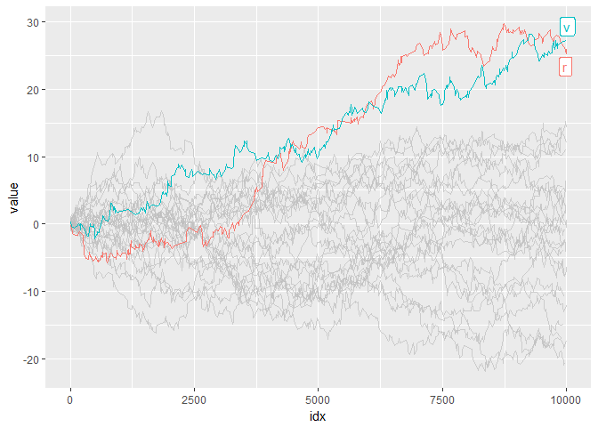

<!-- README.md is generated from README.Rmd. Please edit that file -->
gghighlight
===========

Highlight points and lines in ggplot2.

Installation
------------

You can install gghighlight from github with:

``` r
# install.packages("devtools")
devtools::install_github("yutannihilation/gghighlight")
```

Example
-------

Suppose the data has a lot of series.

``` r
library(tidyverse)

set.seed(1)
d <- tibble(
  idx = 1:10000,
  value = runif(idx, -1, 1),
  type = sample(letters, size = length(idx), replace = TRUE)
) %>%
  group_by(type) %>%
  mutate(value = cumsum(value)) %>%
  ungroup()
```

It is difficult to distinguish them by colour.

``` r
ggplot(d) +
  geom_line(aes(idx, value, colour = type))
```


So we are motivated to highlight only important series, like this:

``` r
library(gghighlight)

ggplot(d) +
  geom_line(aes(idx, value, colour = type)) +
  scale_highlight_colour(max(value) > 20)
```



``` r
ggplot(d) +
  geom_line(aes(idx, value, colour = type)) +
  scale_highlight_colour(max(value) > 20) +
  annotate_highlights(max(value) > 20, aes(idx, value, label = type))
```


``` r
ggplot(d) +
  geom_density(aes(value, fill = type)) +
  scale_highlight_fill(max(value) > 20, .default_colour = ggplot2::alpha("blue", 0.05))
```


