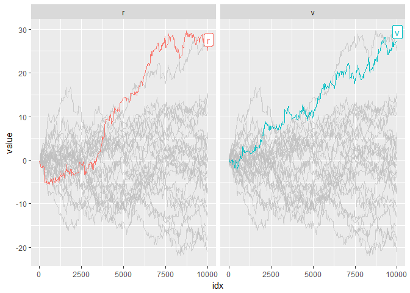
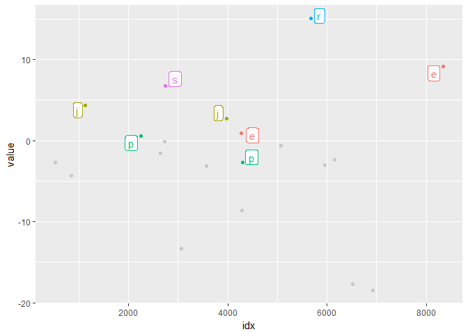
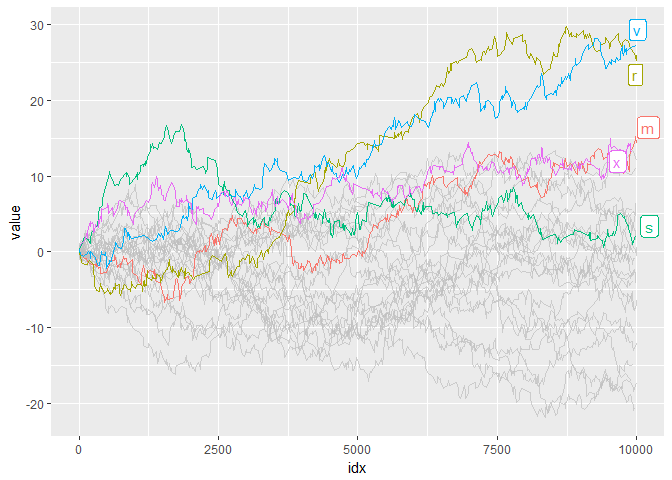

<!-- README.md is generated from README.Rmd. Please edit that file -->
[](https://travis-ci.org/yutannihilation/gghighlight)

gghighlight
===========

Highlight lines and points in ggplot2.

Installation
------------

You can install gghighlight from github with:

``` r
# install.packages("devtools")
devtools::install_github("yutannihilation/gghighlight")
```

Example
-------

Suppose the data has a lot of series.

``` r
library(dplyr, warn.conflicts = FALSE)

set.seed(1)
d <- tibble(
  idx = 1:10000,
  value = runif(idx, -1, 1),
  type = sample(letters, size = length(idx), replace = TRUE)
) %>%
  group_by(type) %>%
  mutate(value = cumsum(value)) %>%
  ungroup()
```

It is difficult to distinguish them by colour.

``` r
library(ggplot2)

ggplot(d) +
  geom_line(aes(idx, value, colour = type))
```


So we are motivated to highlight only important series, like this:

``` r
library(gghighlight)

gghighlight_line(d, aes(idx, value, colour = type), max(value) > 20)
```


As `gghighlight_*()` returns a ggplot object, it is customizable just as we usually do with ggplot2. (Note that, while gghighlights doesn't require ggplot2 loaded, ggplot2 need to be loaded to customize the plot)

``` r
gghighlight_line(d, aes(idx, value, colour = type), max(value) > 20) +
  theme_minimal()
```


The plot also can be facetted:

``` r
gghighlight_line(d, aes(idx, value, colour = type), max(value) > 20) +
  facet_wrap(~ type)
```



### Supported geoms

#### Line

(As shown above)

#### Point

``` r
set.seed(10)
d2 <- sample_n(d, 20)

gghighlight_point(d2, aes(idx, value), value > 0)
#> Warning in gghighlight_point(d2, aes(idx, value), value > 0): Using type as
#> label for now, but please provide the label_key explicity!
```


### Semantics

#### Grouped vs ungrouped

You may notice that the `gghighlight_line()` and `gghighlight_point()` has different semantics.

By default, `gghighlight_line()` calculates `predicate` per group, more precisely, `dplyr::group_by()` + `dplyr::summarise()`. So if the predicate expression returns more than one value per group, it ends up with an error like this:

``` r
gghighlight_line(d, aes(idx, value, colour = type), value > 20)
#> Error in summarise_impl(.data, dots): Column `predicate..........` must be length 1 (a summary value), not 387
```

`gghighlight_point()` calculates `predicate` per row by default. This behaviour can be controled via `use_group_by` argument like this:

``` r
gghighlight_point(d2, aes(idx, value, colour = type), max(value) > 0, use_group_by = TRUE)
#> Warning in gghighlight_point(d2, aes(idx, value, colour = type), max(value)
#> > : Using type as label for now, but please provide the label_key
#> explicity!
```



While `gghighlight_line()` also has `use_group_by` argument, I don't think ungrouped line can be interesting because data that can be represented as line must have series, or groups.

#### Logical predicate vs numerical predicate

To construct a predicate expression like bellow, we need to determine a threshold. But it is difficult to choose a nice one before we draw plots.

``` r
max(value) > 20
```

So, `gghighlight_*()` allows predicates that return numeric (or character) results. The values are used for sorting data and the top `max_highlight` of rows/groups are highlighted:

``` r
gghighlight_line(d, aes(idx, value, colour = type), max(value), max_highlight = 5L)
```


